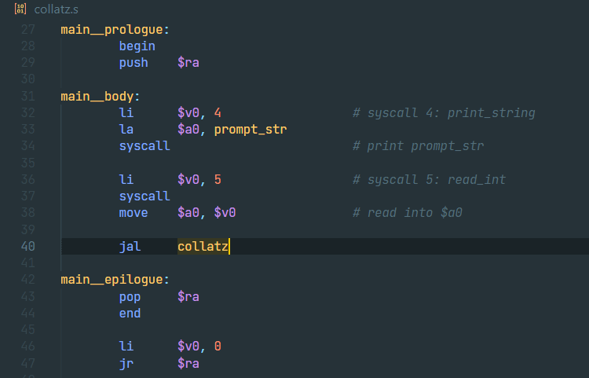
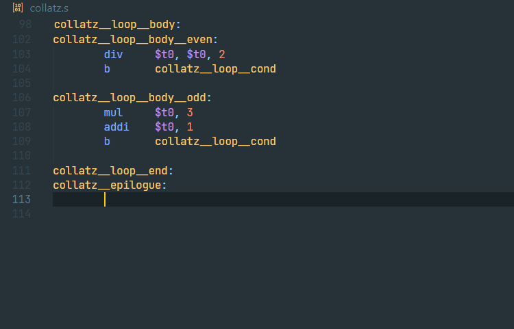
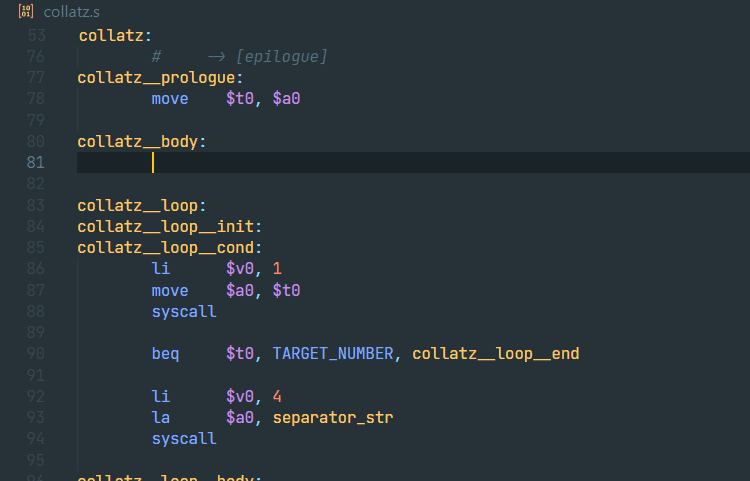
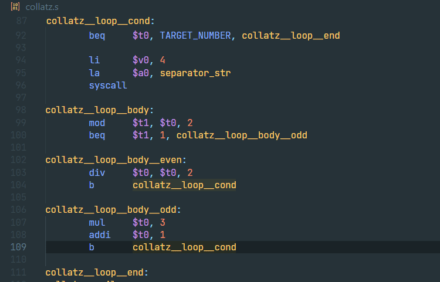

# MARS MIPS Support

This extension adds MIPS assembly language support and execution using MARS simulator.

## Features

### Syntax Highlighting

Semantic syntax highlighting only colourizes labels and constants that are defined elsewhere in the document.



### Code Completion

Context-aware code completion for instructions, directives, instructions, labels, and constants.



### Snippets

Snippets with configurable comment indentation for all supported syscalls.



### Label & Constant Definitions / References

Support for navigating definitions and usages of labels and constants through VS Code's UI.



### Running code with MARS

Run your MIPS code using the MARS simulator directly from VS Code by pressing `F5`. You can also run with extra info using `F6`.

If you just want to open the MARS simulator GUI and run your code there, you can use `F7` - MARS is included with this extension.

### Formatting

A formatter for MIPS assembly is also included, based on [AngaBlue/asm-formatter](https://github.com/AngaBlue/asm-formatter).

## Known Issues

- No support for multi-file projects

## Building

To contribute to or modify the extension, first clone the repository, install dependencies, and open in VSCode:

```
git clone https://github.com/OmerMakesStuff/vscode-mars-mips/
cd vscode-mars-mips
pnpm i
code .
```

Then, inside VSCode, press `F5`. This will compile and run the extension in a new Extension Development Host window.

For information on packaging and distributing the extension, see the [VSCode docs](https://code.visualstudio.com/api/working-with-extensions/publishing-extension).

## Credits

- **Based on [Bahnschrift/vscode-mipsy-support](https://github.com/Bahnschrift/vscode-mipsy-support)**
- Fork of [ahmz1833/vscode-mars-mips](https://github.com/ahmz1833/vscode-mars-mips)
- Formatter: [AngaBlue/asm-formatter](https://github.com/AngaBlue/asm-formatter)
- Run menu and commands, MARS package: [riciopo/vscode-mips](https://github.com/triciopo/vscode-mips)
- Also using [duskmoon314/vscode-mips-mars](https://github.com/duskmoon314/vscode-mips-mars) and [Cheuring/mpis-lauguage-support](https://github.com/Cheuring/mpis-lauguage-support)
